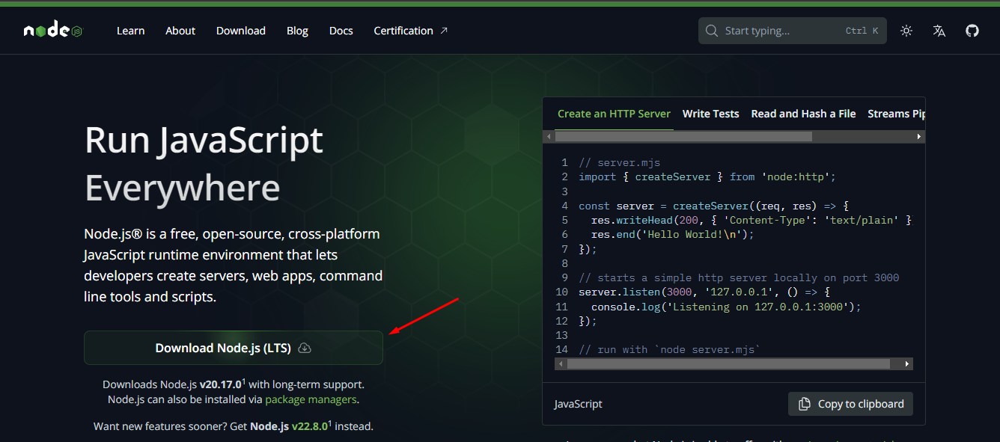

  


## Requisitos
* Para executar a aplicação localmente, é necessário instalar o **Node**.

## Instruções de instalação
Confira abaixo as instruções para a instalação do **Node**:

1. Acesse o [site](https://nodejs.org/en) para realizar o download da versão LTS:



2. Clique na aba **Download** e prossiga com a instalação.

3. Para verificar o sucesso da instalação, abra o terminal e execute o comando:
```bash
node -v
```
